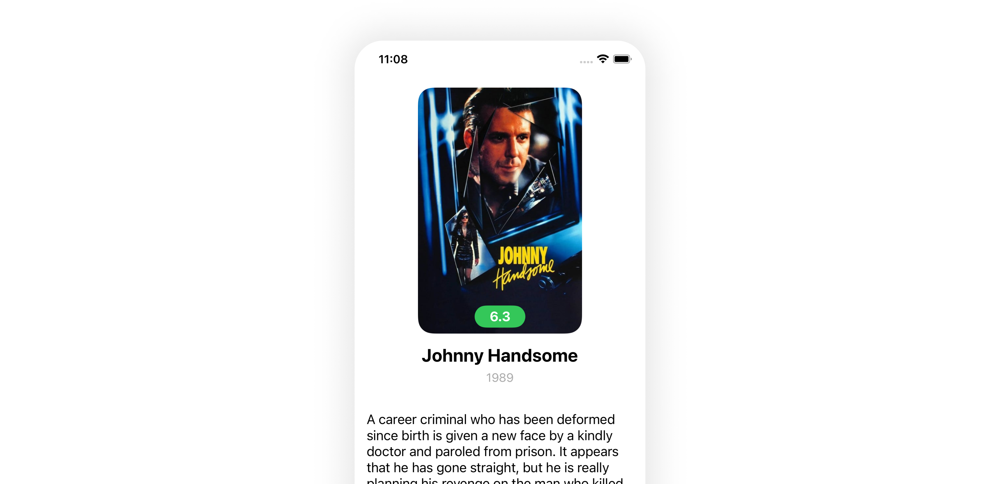

# Film

Приложение для демонстрации информации о фильмах с использованием публичного API из сервиса [The Movie DB](themoviedb.org).



## Установка

Для корректного запуска проекта, необходимо выполнить в корне репозитория команду:

```bash
$ bundle install
```

После перейти в папку `App` и запустить команду:

```bash
$ bundle exec pod install
```

Теперь можно пользоваться проектом!
